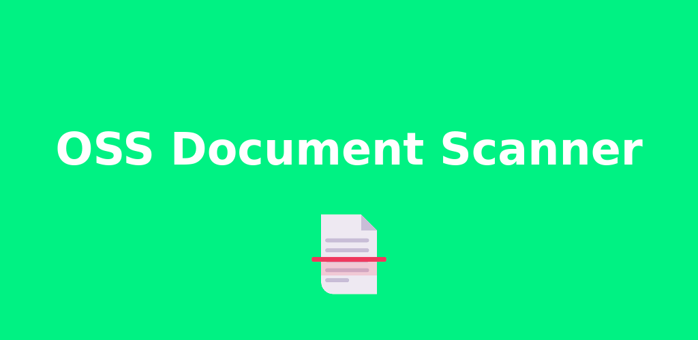
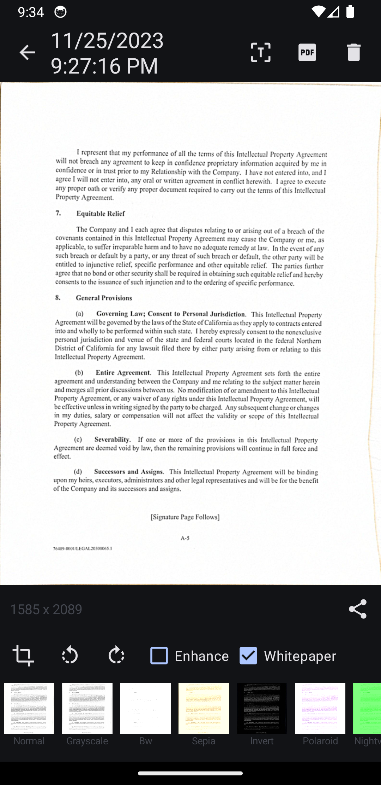

<!-- 
</a>
 -->

<h1 align="center">Scan all your documents</h1>

  
 

 You can get the <a href="https://github.com/com.akylas.documentscanner/releases/latest">latest release on GitHub</a>

<!-- 

 -->

<h2 align="center">Enjoying OSS Document Scanner?</h2>

Please consider making a small donation to help fund the project. Developing an application, especially one that is open source and completely free, takes a lot of time and effort.
 
 

<a href="https://github.com/sponsors/farfromrefug">:heart: Sponsor</a>

Open Source app to scan your documents.

## Screenshots

|  |  |  |

### Having issues, suggestions and feedback?

You can,
- [Create an issue here](https://github.com/Akylas/com.akylas.documentscanner/issues)

### Building

This app uses opencv and tesseract. I did not include the libraries because there are huge and would make the github repo too big.

#### OpenCV

* **Android**:
You can download Opencv 4.8.0 for android [here](https://github.com/opencv/opencv/releases/download/4.8.0/opencv-4.8.0-android-sdk.zip).
Then place the necessary libs/includes in the `opencv/android` at the root of this repo like shown here:

* **iOS** :
You can download Opencv 4.8.0 for iOS [here](https://github.com/opencv/opencv/releases/download/4.8.0/opencv-4.8.0-ios-framework.zip).
Then place the `opencv2.xcframework` in the `opencv/ios` at the root of this repo

This should be enough. Android and iOS build will use it using symlinks

#### Tesseract
It is a bit trickier for Tesseract as we need to compile it 

* **Android**:
    - clone [https://github.com/Akylas/Tesseract4Android](https://github.com/Akylas/Tesseract4Android)
    - build with `./gradlew assembleRelease`
    - search for the built static libs (search for `libtesseract.a`) in `tesseract4android/build/intermediates/cxx/*/obj`
    - copy the static libs and the includes(in `tesseract4android/src/main/cpp/tesseract/src/include`) in the `tesseract/android` at the root of this repo like shown here:

* **iOS**:
    - clone [https://github.com/Akylas/TesseractBuild](https://github.com/Akylas/TesseractBuild)
    - build with `./Scripts/Build_All.sh`
    - copy everything from `Root` to the `tesseract/ios` at the root of this repo

#### Yarn

You need to use yarn with this project as it uses the `portal:` protocol for some dependencies.
Note that the project has some `yarn link` for easy local dev for me. The best is for you to remove the `resolutions` part of the `package.json`