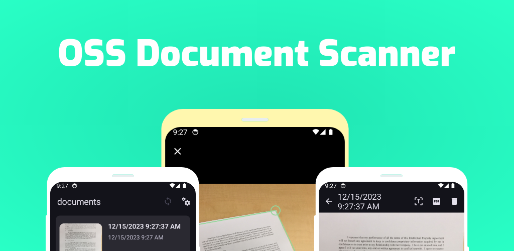
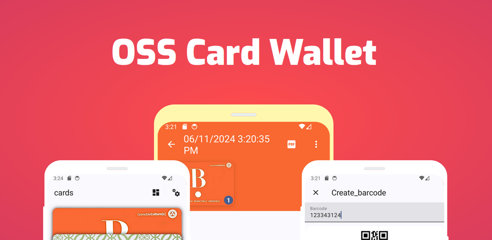
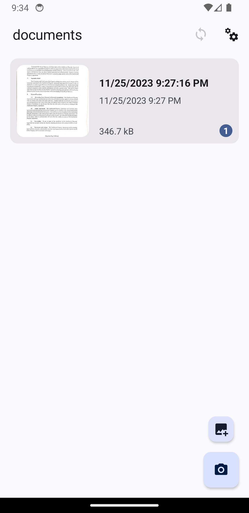
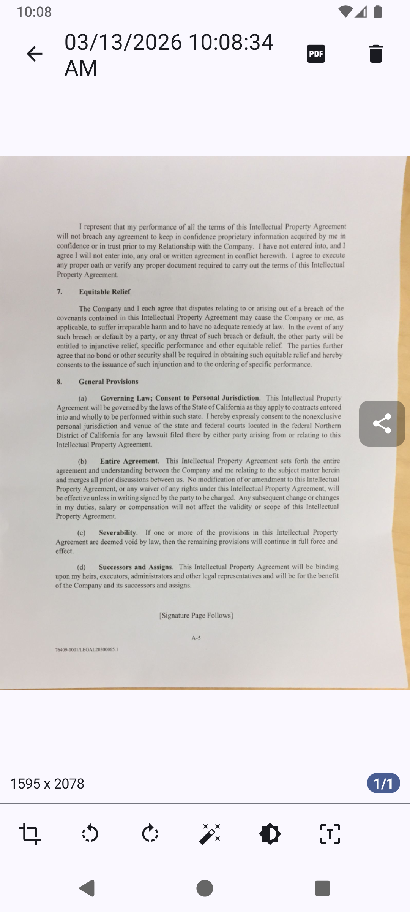
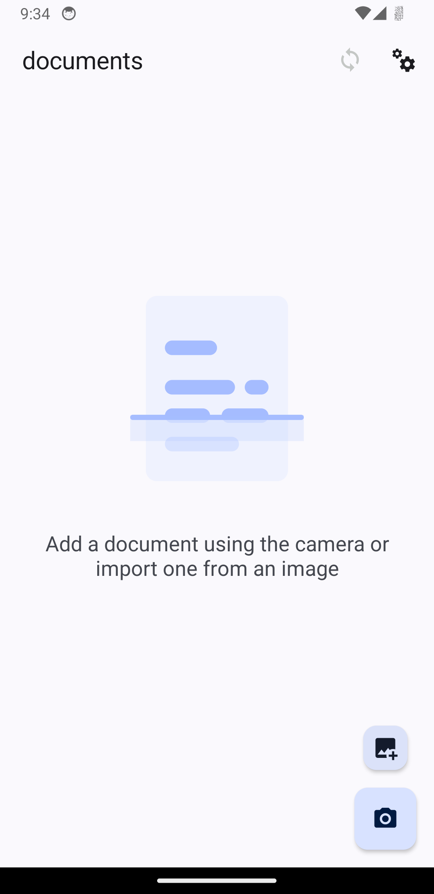
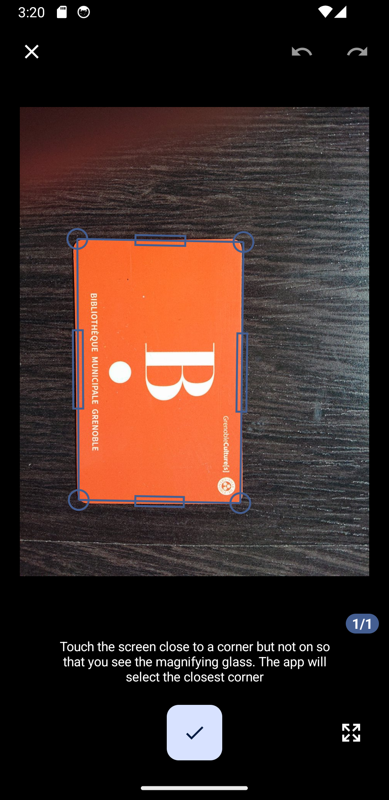
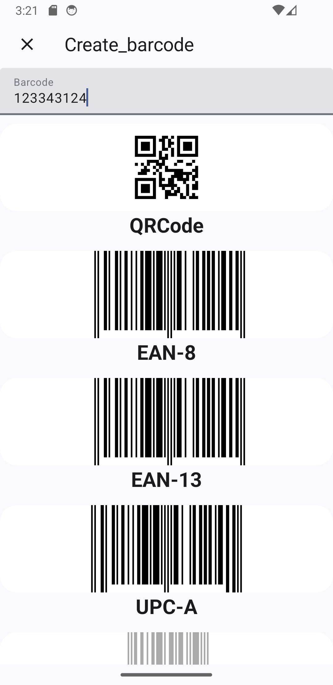
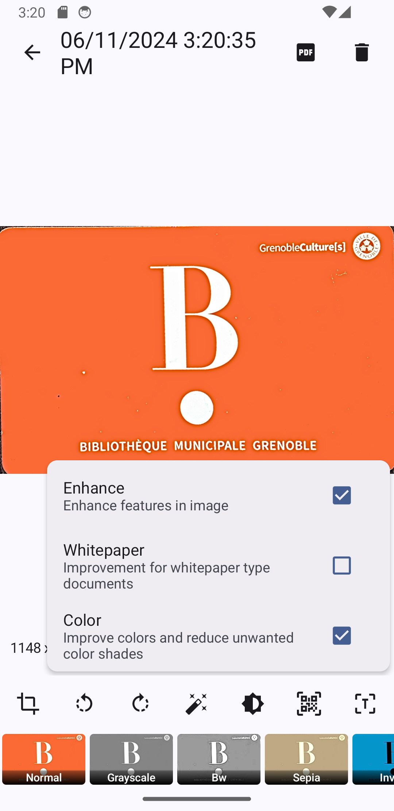
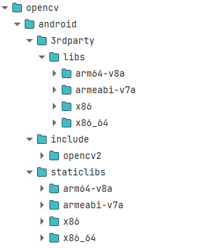
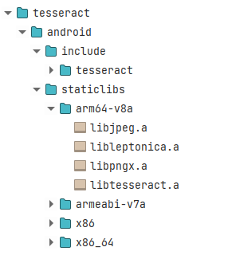

This repository is now the home of 2 apps

 ## Installation

<!--  -->

| OSS Document Scanner | Oss CardWallet |
|:--------------------:|:--------------:|
|||
|||
|||
|||
|[](https://apps.obtainium.imranr.dev/redirect?r=obtainium://app/%7B%22id%22%3A%22com.akylas.documentscanner%22%2C%22url%22%3A%22https%3A%2F%2Fgithub.com%2FAkylas%2FOSS-DocumentScanner%22%2C%22author%22%3A%22Akylas%22%2C%22name%22%3A%22OSS%20Document%20Scanner%22%2C%22preferredApkIndex%22%3A0%2C%22additionalSettings%22%3A%22%7B%5C%22includePrereleases%5C%22%3Afalse%2C%5C%22fallbackToOlderReleases%5C%22%3Atrue%2C%5C%22filterReleaseTitlesByRegEx%5C%22%3A%5C%22Document%20Scanner%5C%22%2C%5C%22filterReleaseNotesByRegEx%5C%22%3A%5C%22%5C%22%2C%5C%22verifyLatestTag%5C%22%3Afalse%2C%5C%22dontSortReleasesList%5C%22%3Afalse%2C%5C%22useLatestAssetDateAsReleaseDate%5C%22%3Afalse%2C%5C%22trackOnly%5C%22%3Afalse%2C%5C%22versionExtractionRegEx%5C%22%3A%5C%22github%2F(.%2B)%5C%22%2C%5C%22matchGroupToUse%5C%22%3A%5C%221%5C%22%2C%5C%22versionDetection%5C%22%3Afalse%2C%5C%22releaseDateAsVersion%5C%22%3Afalse%2C%5C%22useVersionCodeAsOSVersion%5C%22%3Afalse%2C%5C%22apkFilterRegEx%5C%22%3A%5C%22%5C%22%2C%5C%22invertAPKFilter%5C%22%3Afalse%2C%5C%22autoApkFilterByArch%5C%22%3Atrue%2C%5C%22appName%5C%22%3A%5C%22%5C%22%2C%5C%22shizukuPretendToBeGooglePlay%5C%22%3Afalse%2C%5C%22exemptFromBackgroundUpdates%5C%22%3Afalse%2C%5C%22skipUpdateNotifications%5C%22%3Afalse%2C%5C%22about%5C%22%3A%5C%22%5C%22%7D%22%2C%22overrideSource%22%3Anull%7D)|[](https%3A%2F%2Fapps.obtainium.imranr.dev%2Fredirect%3Fr%3Dobtainium%3A%2F%2Fapp%2F%7B%22id%22%3A%22com.akylas.cardwallet%22%2C%22url%22%3A%22https%3A%2F%2Fgithub.com%2FAkylas%2FOSS-DocumentScanner%22%2C%22author%22%3A%22Akylas%22%2C%22name%22%3A%22OSS%20Card%20Wallet%22%2C%22preferredApkIndex%22%3A0%2C%22additionalSettings%22%3A%22%7B%5C%22includePrereleases%5C%22%3Afalse%2C%5C%22fallbackToOlderReleases%5C%22%3Atrue%2C%5C%22filterReleaseTitlesByRegEx%5C%22%3A%5C%22Card%20Wallet%5C%22%2C%5C%22filterReleaseNotesByRegEx%5C%22%3A%5C%22%5C%22%2C%5C%22verifyLatestTag%5C%22%3Afalse%2C%5C%22dontSortReleasesList%5C%22%3Afalse%2C%5C%22useLatestAssetDateAsReleaseDate%5C%22%3Afalse%2C%5C%22trackOnly%5C%22%3Afalse%2C%5C%22versionExtractionRegEx%5C%22%3A%5C%22github%2F%28.%2B%29%5C%22%2C%5C%22versionDetection%5C%22%3Afalse%2C%5C%22releaseDateAsVersion%5C%22%3Afalse%2C%5C%22useVersionCodeAsOSVersion%5C%22%3Afalse%2C%5C%22apkFilterRegEx%5C%22%3A%5C%22%5C%22%2C%5C%22invertAPKFilter%5C%22%3Afalse%2C%5C%22autoApkFilterByArch%5C%22%3Atrue%2C%5C%22appName%5C%22%3A%5C%22%5C%22%2C%5C%22shizukuPretendToBeGooglePlay%5C%22%3Afalse%2C%5C%22exemptFromBackgroundUpdates%5C%22%3Afalse%2C%5C%22skipUpdateNotifications%5C%22%3Afalse%2C%5C%22about%5C%22%3A%5C%22%5C%22%7D%22%2C%22overrideSource%22%3Anull%7D%29)|

 
<h2 align="center">Enjoying OSS Document Scanner or OSS Card Wallet?</h2>

Please consider making a small donation to help fund the project. Developing an application, especially one that is open source and completely free, takes a lot of time and effort.
 
 

<a href="https://github.com/sponsors/farfromrefug">:heart: Sponsor</a>

Open Source app to scan your documents.

## Screenshots

|  |  |  |

|  |  |  |

## Having issues, suggestions and feedback?

You can,
- [Create an issue here](https://github.com/Akylas/OSS-DocumentScanner/issues)

## Contributors

Thanks to our contributors:
* [Enrico Dell'Oste](https://www.smartpixel.it/)

## Languages: 

The Translations are hosted by [Weblate.org](https://hosted.weblate.org/engage/oss-document-scanner/).

  

Feature Graphic generated with [hotpot.ai](https://hotpot.ai/design/google-play-feature-graphic)

## Building Setup

This repo can be used to build 2 different apps: `OSS DocumentScanner` and `OSS CardWallet`

Those apps are using [Nativescript](https://github.com/NativeScript/NativeScript) which is a cross platform framework to build apps for iOS/Android

### Setup / Environment

This project uses a few environment variables. While most are for publishing and thus not necessary for most, some are used to decide which app to build: 
* `APP_ID`: `com.akylas.documentscanner` or `com.akylas.cardwallet`
* `APP_BUILD_PATH`: `build/documentscanner` or `build/cardwallet`
* `APP_RESOURCES`: `App_Resources/documentscanner` or `App_Resources/cardwallet`

You can either define them yourself. If you are using vscode the `vscode/settings.json` of this repo defines different custom shells which will try to source `.env.documentscanner` and `.env.cardwallet`. To do this it use the plugin `dotenv` from omzsh [here](https://github.com/ohmyzsh/ohmyzsh/tree/master/plugins/dotenv)
If those variables are not define the project will default to variables for `OSS DocumentScanner`

### Nativescript

First [setup Nativescript](https://docs.nativescript.org/setup/linux)

This project is optimized to be built with [Akylas Fork](https://github.com/Akylas/NativeScript). Though it would work with main it is best to use this fork. The `package.json` defines a resolution to `../NativeScript/dist/packages/core` so clone the fork and build it using `npm run setup:yarn && npm run ui-mobile-base:build && npm run core:build`

Another change is that this project uses new features of the Nativescript [cli](https://github.com/farfromrefug/nativescript-cli) which were not released yet.
So for now you need to clone [it](https://github.com/farfromrefug/nativescript-cli), build with `npm run setup` then use it with `PATH_TO_CLI_FOLDER/bin/ns`

### 3rd parties

This app also uses opencv and tesseract. I did not include the libraries in git because there are huge and would make the github repo too big.
There are 2 ways to install them:
* download from [here](https://github.com/Akylas/OSS-DocumentScanner/releases/tag/dev_resources) and uncompress them at the root
* build them yourself:

#### OpenCV

* **Android**:
You can download Opencv 4.8.0 for android [here](https://github.com/nihui/opencv-mobile/releases/latest/download/opencv-mobile-4.8.1-apple.zip).
Then place the necessary libs/includes in the `opencv/android` at the root of this repo like shown here:

* **iOS** :
You can download Opencv 4.8.0 for iOS [here](https://github.com/opencv/opencv/releases/download/4.8.0/opencv-4.8.0-ios-framework.zip).
Then place the `opencv2.xcframework` in the `opencv/ios` at the root of this repo

This should be enough. Android and iOS build will use it using symlinks

#### Tesseract
It is a bit trickier for Tesseract as we need to compile it 

* **Android**:
    - clone [https://github.com/Akylas/Tesseract4Android](https://github.com/Akylas/Tesseract4Android)
    - build with `./gradlew assembleRelease`
    - search for the built static libs (search for `libtesseract.a`) in `tesseract4android/build/intermediates/cxx/*/obj`
    - copy the static libs and the includes(in `tesseract4android/src/main/cpp/tesseract/src/include`) in the `tesseract/android` at the root of this repo like shown here:

* **iOS**:
    - clone [https://github.com/Akylas/TesseractBuild](https://github.com/Akylas/TesseractBuild)
    - build with `./Scripts/Build_All.sh`
    - copy everything from `Root` to the `tesseract/ios` at the root of this repo

### Yarn

You need to use yarn with this project as it uses the `portal:` protocol for some dependencies.
Note that the project has some `yarn link` for easy local dev for me. The best is for you to remove the `resolutions` part of the `package.json`

### Building

Now that all is setup and that you prepared the 3rd party libraries you can actually build and run the app:

* `yarn`
* `ns run android --no-hmr --env.devlog` (replace by `ios` for iOS...)

This should run the app on the first discovered device or emulator.